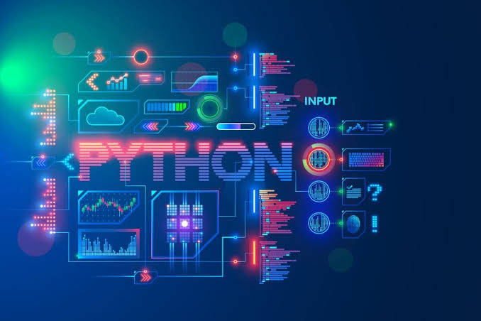

# Notebook: Aprendendo Python

## 1. Tema e Objetivo do Notebook
* **Título:** Aprendendo Python
* **Objetivo Principal:** Ser a referência base no aprendizado da linguagem Python para um engenheiro com conhecimentos prévios intermediários (em linguagens como Pascal, C, Fortran e Basic) [142]. O notebook visa ensinar de forma didática conceitos de programação "pythoniana", com foco aplicado em Análise de Dados, Machine Learning, Inteligência Artificial e Deep Learning [142].

---

## 2. Fontes Presentes no Notebook
O acervo do notebook é composto por 50 fontes diversificadas (tutoriais interativos, documentações oficiais, artigos de engenharia, cursos universitários e videoaulas), organizadas nos seguintes pilares [85, 142]:

### Pilar 1: Fundamentos e Rotas de Aprendizado Inicial
* **Cursos Universitários e Acadêmicos:**
  * *Harvard CS50P – Introduction to Programming with Python* (David J. Malan) [2, 81, 86, 146]
  * *MIT 6.100L – Introduction to CS and Programming using Python* [24, 31]
* **Abordagem Utilitária e Automação:**
  * *Automate the Boring Stuff with Python* (Al Sweigart / Invent with Python) [87, 143, 281]
  * *Python for Everybody (PY4E)* (Dr. Charles Severance) [20, 87]
* **Plataformas Interativas e Tutoriais Iniciais:**
  * *Scrimba (Learn Python 3)* [11, 71, 73]
  * *Codecademy, DataCamp, freeCodeCamp, LeetCode, Rivery* [16, 19, 22]
  * *Google Python Class (Google for Developers)* [9, 58]
  * *Microsoft Learn – Python para Iniciantes* [43, 367]
  * *PyLadies BH – Curso de Programação em Python para Iniciantes* [16, 94, 95]
  * *LearnPython.org, TutorialsPoint, Hejex Technology* [26, 41, 42]

### Pilar 2: Engenharia de Software Intermediária e Boas Práticas
* **Guias Práticos e Arquitetura de Projetos:**
  * *Real Python* (Tutoriais intermediários, planos de estudo e membership) [3, 29, 32, 269, 370]
  * *The Hitchhiker's Guide to Python!* [15, 46, 376]
  * *Full Stack Python* (Desenvolvimento, deployment e ecossistemas web/bancos de dados) [18, 138, 140]
  * *Intermediate Research Software Development* [23, 35]
* **Conceitos Fundamentais:** Programação Orientada a Objetos (POO), exceções (`try-except-else-finally`), manipulação de arquivos e isolamento de ambientes virtuais (`venv`, `Pipenv`) [54, 88, 89].

### Pilar 3: Conceitos Avançados, Metaprogramação e CPython Internals
* **Conceitos Avançados e Internals:**
  * *Advanced Python Concepts Every Developer Should Master (2026 Guide - Hul Hub)* [6, 35, 36]
  * *Advanced Python Concepts (Victorious Digital)* [7, 42, 43]
  * *ThePythonBook / PythonCompiler.io* [5, 33, 34]
  * *Language & Framework Internals / Shared Memory* (Abhik Sarkar) [11, 25, 40]
  * *Breaking Boundaries* (aryaman.space) [22, 78]
* **Documentação Oficial e Evolução do CPython:**
  * *Documentação Oficial do Python (3.12, 3.13, 3.14.8)* [3, 10, 24, 47]
  * *Remoção do GIL (Global Interpreter Lock) e Free-Threading* (Vonage, C API Docs, DEV Community) [12, 13, 29, 36, 311, 374]
  * *Novidades de Sintaxe:* T-strings no Python 3.14 e otimizações do interpretador adaptativo [37, 308, 312]

### Pilar 4: Aplicações Práticas, Análise de Dados e Certificações
* **Projetos Práticos e Visualização de Dados:**
  * *Projeto de Análise de Dados usando Python na prática* [33, 300]
  * *É o fim do Power BI? Criando Dashboard com Python em 15 minutos (Asimov Academy)* [1, 50, 398, 406]
* **Certificações Profissionais da Indústria:**
  * *Python Institute / OpenEDG* (Certificações PCEP™, PCAP™, PCPP™) [25, 38, 87, 91, 313]

---

## 3. Diretriz de Comportamento do Notebook
O notebook está programado para atuar estritamente sob a seguinte diretriz de conduta [142]:

* **Persona:** **Guia de Aprendizado / Professor de Informática**, focado em explicar conceitos complexos de forma simples e acessível [142].
* **Tom e Estilo:** Profissional, acolhedor e direto [142]. Respostas claras, organizadas em tópicos (*bullet points*), sem prolixidade e com embasamento direto nas fontes [142].
* **Estratégia de Interação:** Condução de uma conversa natural e fluida [142]. Proibido o uso de "quizzes" não solicitados ou testes de memorização mecânica. Prioridade para tirar dúvidas diretamente e propor próximos passos práticos.
* **Rigor de Grounding:** Todas as declarações fáticas devem ser rastreáveis e citadas a partir das fontes fornecidas no caderno [142].

---

## 4. Exemplos de Pesquisas Realizadas: A Linguagem Python e o Conceito de Decoradores

### 4.1. Resumo da Linguagem Python
* **Origem e Criação:** Criada por **Guido van Rossum** entre 1985 e 1990 (com código aberto sob a licença GPL), a linguagem foi projetada para priorizar a legibilidade do código e a produtividade do desenvolvedor [337].
* **Principais Características:**
  * **Interpretada e Dinâmica:** Executada por um interpretador (como o CPython) sem a necessidade de compilação prévia para binários estáticos, contando com tipagem dinâmica e verificação em tempo de execução [85, 337, 339, 381].
  * **Sintaxe Limpa e Indentação Significativa:** Utiliza a indentação para delimitar blocos de código em vez de chaves `{}` ou palavras-chave `begin/end`, o que garante legibilidade e padronização [101, 337].
  * **Gerenciamento Automático de Memória:** Possui coleta de lixo (*garbage collection*) e contagem de referências para desalocação de objetos em memória [85, 337].
  * **Multiparadigma:** Suporta o paradigma imperativo/estruturado, Programação Orientada a Objetos (POO) e elementos de programação funcional [88, 337, 339].
* **Principais Vantagens:**
  * Curva de aprendizado suave e rápida escrita de código (*expressividade*) [36, 110, 341].
  * Ecossistema vasto e maduro de bibliotecas padrão e de terceiros [341, 382].
  * Portabilidade multiplataforma (executa identicamente em Windows, Linux e macOS) [110, 341].
* **Onde é Empregada Atualmente:**
  * **Ciência de Dados, IA e Machine Learning:** Biblioteca padrão de mercado com `pandas`, `NumPy`, `Matplotlib`, `scikit-learn`, `PyTorch` e `TensorFlow` [4, 74, 85, 340].
  * **Desenvolvimento Web & APIs:** Frameworks como `Django`, `Flask` e `FastAPI` [3, 62, 74, 340].
  * **Automação e Scripting:** Automação de processos corporativos, planilhas, PDFs e *web scraping* (`BeautifulSoup`, `Selenium`) [4, 87, 340].
  * **Engenharia de Software e Infraestrutura:** Ferramentas de DevOps, testes automatizados e integração de sistemas [64, 70, 340].

---

### 4.2. O que é um Decorador (*Decorator*) em Python?
* **Conceito:** Um **decorador** é uma função de ordem superior (*higher-order function*) que recebe outra função como argumento e estende ou modifica o seu comportamento sem alterar o seu código-fonte original [37, 44, 90, 356].
* **Mecânica Interna:** O funcionamento dos decoradores baseia-se em dois conceitos fundamentais do Python [37, 356]:
  1. **Funções como Cidadãs de Primeira Classe (*First-Class Citizens*):** Funções podem ser passadas como parâmetros, atribuídas a variáveis e retornadas por outras funções [37, 356].
  2. **Fechamentos (*Closures*):** Uma função interna (*wrapper*) retém o acesso ao escopo e variáveis da função externa mesmo após a execução desta ser concluída [37, 271].
* **Onde é Emprovado na Prática:**
  * **Autenticação e Autorização:** Verificar se um usuário está logado antes de executar uma rota web em Django ou Flask [38, 45].
  * **Logging e Auditoria:** Registrar quando uma função é chamada, seus argumentos e o resultado retornado [38, 45].
  * **Medição de Desempenho (*Profiling*):** Cronometrar o tempo de execução de funções em produção [38].
  * **Caching de Resultados:** Evitar recomputações dispendiosas utilizando `@functools.lru_cache` [38].
  * **Validação e Modificação de Métodos:** Decoradores embutidos como `@property`, `@classmethod`, `@staticmethod` e o novo `@override` do Python 3.12 [40, 309].

---

### 4.3. Explicação Didática e Exemplo Prático de Decorador

Imagine que você quer medir quanto tempo uma função demora para executar, mas não quer repetir o código de cronometragem dentro de cada função do seu sistema [38]. Um decorador funciona como uma "embalagem" em volta da função original [356, 357].

#### Exemplo de Código em Python:

```python
import time

# 1. Definimos a função decoradora que recebe a função original
def meu_decorador_de_tempo(func_original):
    # 2. Criamos uma função interna 'wrapper' que embrulha a execução
    def wrapper(*args, **kwargs):
        print(f"--- [LOG] Iniciando execução da função '{func_original.__name__}' ---")
        inicio = time.time()
        
        # 3. Executamos a função original recebida
        resultado = func_original(*args, **kwargs)
        
        fim = time.time()
        print(f"--- [LOG] Função concluída em {fim - inicio:.4f} segundos ---")
        
        # 4. Retornamos o resultado da função original
        return resultado
    
    # 5. Retornamos a função wrapper sem executá-la
    return wrapper

# Usando o açúcar sintático '@' para aplicar o decorador
@meu_decorador_de_tempo
def processar_dados(limite):
    total = sum(i ** 2 for i in range(limite))
    return total

# Chamando a função normalmente
resultado = processar_dados(5000000)
print(f"Resultado do cálculo: {resultado}")
```

**Saída Esperada no Terminal:**
```text
--- [LOG] Iniciando execução da função 'processar_dados' ---
--- [LOG] Função concluída em 0.3821 segundos ---
Resultado do cálculo: 416666625000000000
```

---

## 5. Link do Notebook Compartilhado
* **Acesse o caderno completo no Gemini Notebook:** [Link para o Notebook Aprendendo Python](https://notebook.google.com/notebook/0f0fb38d-d578-4468-b579-3338789a7662)
